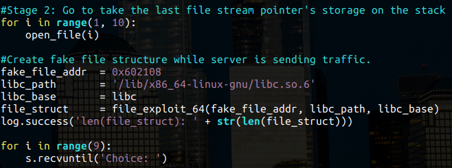
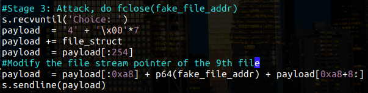
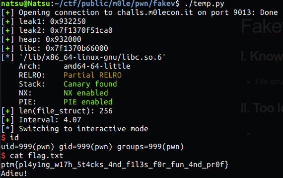

# Fakev (pwn) - m0lecon CTF Teaser 2020 

note: This is just a quick writeup.

## I. Knowledge

- File structure exploit
- Use after free vulnerability

## II. Solution

- Open 8 files, close them and read the first one (use after free) for leaking heap and libc addresses.

  

- Open 9 files, the place where the program store file stream pointer of the 9th file is on the stack. We can modify this value to our fake file stream pointer.

  

- Craft the fake file structure and make the program fclose() it.

  

## Result

